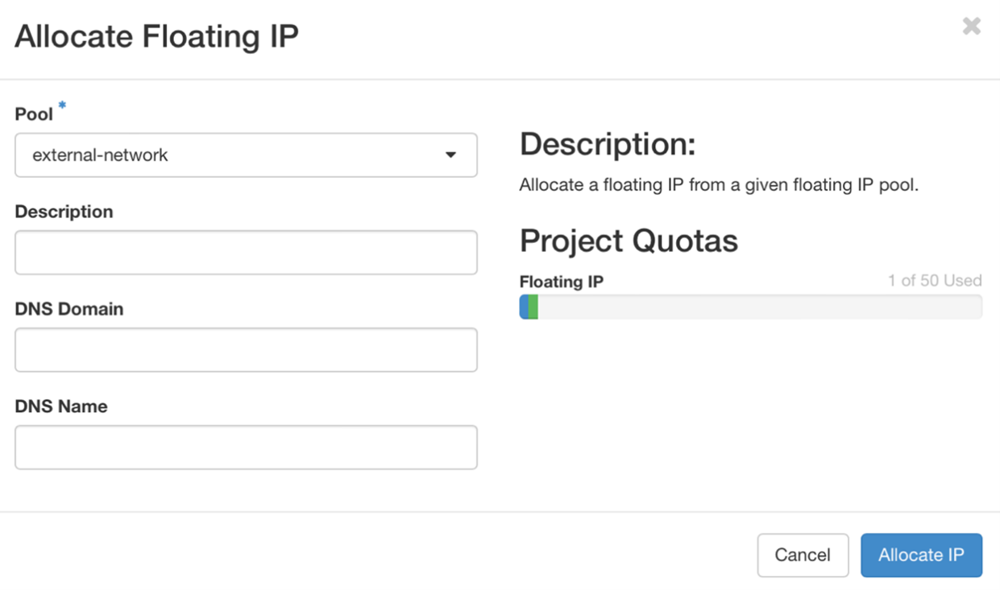

## 3️⃣ MicroStack Configuration on Server 1
### 🖼️ 3.1 Manage Image
#### 3.1.1 Download the Cloud Image (Ubuntu 22.04 Cloud)
```bash
wget https://cloud-images.ubuntu.com/releases/22.04/release/ubuntu-22.04-server-cloudimg-amd64.img
```
#### 3.1.2 Move the image to the snap’s accessible folder
```bash
cp ./ubuntu-22.04-server-cloudimg-amd64.img ~/snap/microstack/common/
```
#### 3.1.3 Upload the Image to OpenStack
```bash
microstack.openstack image create \
  --file ~/snap/microstack/common/ubuntu-22.04-server-cloudimg-amd64.img \
  --container-format bare \
  --disk-format qcow2 \
  --public \
  ubuntucloud
```
#### 3.1.4 Verify the Image Upload
```bash
microstack.openstack image list
```

 

### ⚡ 3.2 Manage Flavors
#### 3.2.1 Create a New Flavor
```bash
microstack.openstack flavor create --ram 16384 --disk 200 --vcpus 8 5gflavor
```
⚠️ **Note:** 8 CPU, 16GB RAM, 200GB Storage, Name: 5gflavor
#### 3.2.2 List All Flavors
```bash
microstack.openstack flavor list
```

 

### 🔐 3.3 Manage Roles
#### 3.3.1 Create the member role
```bash
microstack.openstack role create member
```
#### 3.3.2 List all roles
```bash
microstack.openstack role list
```

 

### 📂 3.4 Manage Projects
#### 3.4.1 Create the project
```bash
microstack.openstack project create 5GNetworkSlicing
```
#### 3.4.2 List all projects
```bash
microstack.openstack project list
```

 

### 👥 3.5 Manage Users and Groups
#### 3.5.1 Create the user
```bash
microstack.openstack user create --password mmuzte123 user 
```
#### 3.5.2 List all users
```bash
microstack.openstack user list
```
#### 3.5.3 Create the group
```bash
microstack.openstack group create 5Ggroup
```
#### 3.5.4 List all groups
```bash
microstack.openstack group list
```

 

### 🛡️ 3.6 Manage Membership and Assignments
#### 3.6.1 Add the user to the 5Ggroup group
```bash
microstack.openstack group add user 5Ggroup user 
```
#### 3.6.2 Assign the member role to the 5Ggroup group on the 5GNetworkSlicing project
```bash
microstack.openstack role add --project 5GNetworkSlicing --group 5Ggroup member
```

 

### 🔑 3.7 Adding SSH Keypair
#### 3.7.1 Create the key pair
```bash
ssh-keygen -t rsa -b 4096 -f ~/server1key.pem

cp ~/server1key.pem.pub ~/snap/microstack/common/server1key.pub

microstack.openstack keypair create --public-key ~/snap/microstack/common/server1key.pub server1key
```
#### 3.7.2 List keypairs
```bash
microstack.openstack keypair list
```

 

### 🌐 3.8 Configure Network Resources
#### 3.8.1 Create Internal Network & Subnet (via Dashboard)
- Navigate: Project → Network → Networks → Create Network
- Fill in details and click Create
  
.png)
.png)
.png)


#### 3.8.2 Create Router (via Dashboard)
- Navigate: Project → Network → Routers → Create Router
- Fill in details and click Create
  


#### 3.8.3 Adding subnet to the Router (via Dashboard)
- Project → Network → Routers → Router Name → Interfaces → Add Interface
- Select the subnet created and click Submit
  
.png)

#### 3.8.4 Allocate Floating IP (via Dashboard)
- Navigate: Project → Network → Floating IPs → Allocate IP
- Select the external network pool and click Allocate IP
  


 

### 🔒 3.9 Manage Security Groups
#### 3.9.1 Create a security group
```bash
microstack.openstack security group create 5Gsecuritygroup
```
#### 3.9.2 List security groups
```bash
microstack.openstack security group list
```
#### 3.9.3 Add rules (via Dashboard)
- Navigate: Project → Network → Security Groups → Manage Rules
- Add rules for ICMP (ping) and SSH (port 22)
- Fill in the form as the left figure below and click Add. Then repeat the step to add another rule as the right figure.
  


 

🖥️ 3.10 Launching Instances
### 3.10.1 Launch Instance (CLI)
```bash
microstack.openstack server create --flavor 5gflavor --image ubuntucloud \
--network internal-network --key-name server1key \
--security-group 5Gsecuritygroup Microstack1
```
### 3.10.2 List Instances
```bash
microstack.openstack server list
```
### 3.10.3 Assign Floating IP (via Dashboard)
- Navigate: Project → Compute → Instances → Actions → Associate Floating IP
- Select the IP Address that has been allocated and click Associate


---

## ✅ 4. Verifying MicroStack Installation
### 4.1 Check OpenStack Services
```bash
microstack.openstack service list
microstack.openstack endpoint list
```
⚠️ **Note:** Check that each service has the appropriate public, internal, and admin endpoints
