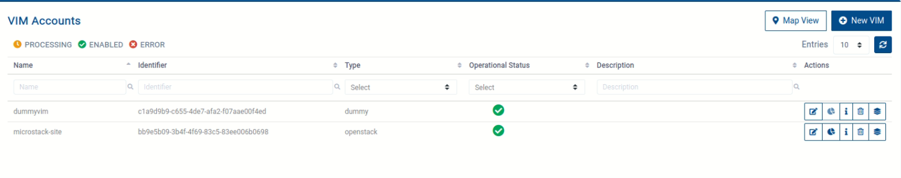

## 3️⃣ OSM Configuration on Server 1
### 📝 3.1 OSM adding new VIM
#### 3.1.1 Export OSM_HOSTNAME
```bash
export OSM_HOSTNAME=nbi.<hostname.ip>.nip.io:443
```
> 💡 Replace `<hostname.ip>` with your actual hostname IP,  
>    For example: `OSM_HOSTNAME=nbi.192.168.0.195.nip.io:443`.

&nbsp;

#### 3.1.2 Create new VIM
```bash
osm vim-create \
  --name <vim_name> \
  --user <username> \
  --password <password> \
  --auth_url https://<openstack_controller_ip>:5000/v2.0 \
  --tenant <tenant_name> \
  --account_type openstack \
  --config='{security_groups: <security_group>, keypair: <keypair_name>}'
```

---

## ✅ 4. Verifying new VIM Status (via Dashboard)
- Navigate: Dashboard → VIM Accounts
  


⚠️ **Note:** The Operational Status will become enable if successful.
